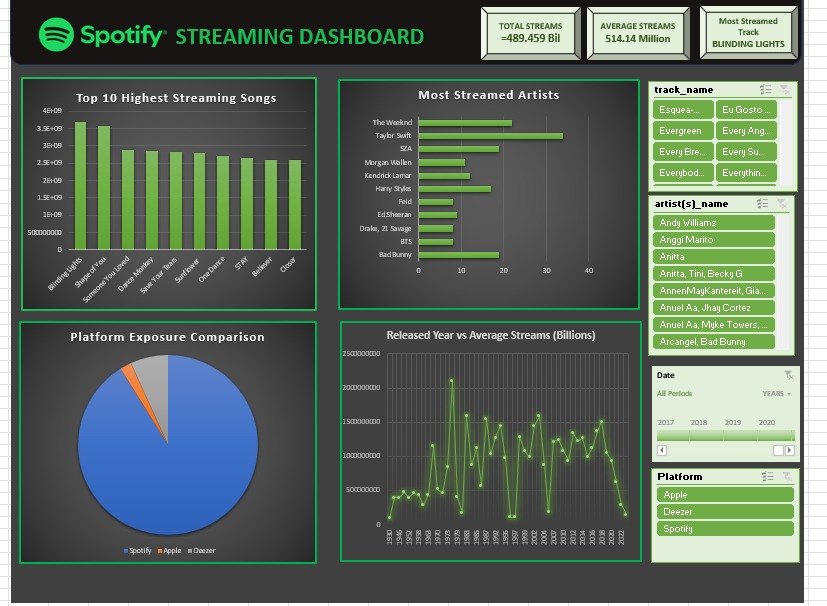
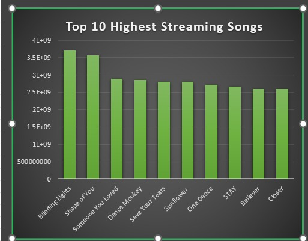
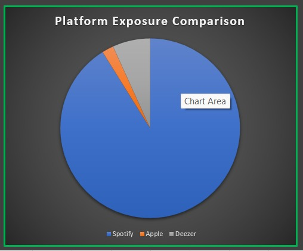
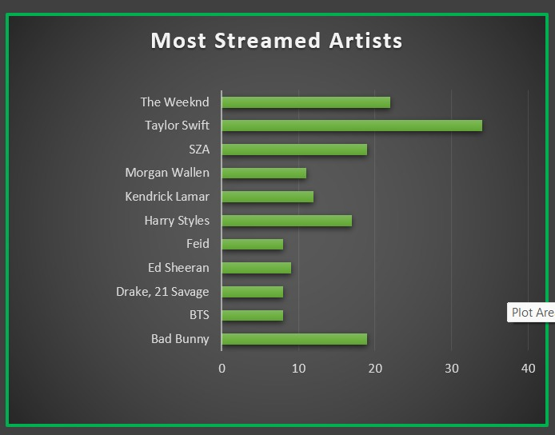
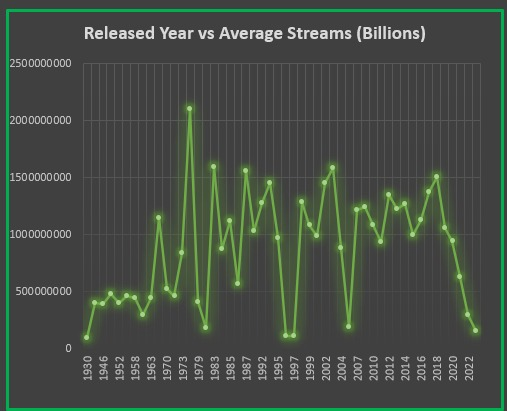

# Spotify Streaming Trends & Platform Performance Analysis (2020–2023)
### Dashboard 

## 📌 Project Overview
This project analyzes a dataset of **953 top-streamed tracks** on Spotify to uncover the ingredients of a global hit. Beyond just stream counts, this analysis explores how audio features (like BPM and danceability) and platform-specific exposure (Spotify vs. Apple Music vs. Deezer) influence a song's success.

## ❓ Business Questions & Visual Insights
I structured this analysis around key business questions. Below are the visual findings from the dashboard:
### 1. Which tracks and artists are the "Heavy Hitters"?
* **Insight:** Taylor Swift leads with 34 tracks in the top list, while *Blinding Lights* holds the individual record for streams (~3.7B).
* **Visual:**
* 

### 2. Which platform provides the most exposure?
* **Insight:** Spotify is the clear leader in playlist ecosystem dominance, with over 4.9M playlist inclusions, dwarfing Apple Music and Deezer.
* **Visual:**
* 

### 3. Does song popularity increase over time?
* **Insight:** While 2022–2023 saw the highest volume of new hits, songs from 2020 show higher average "streaming longevity."
* **Visual:**
* 

### 4. Is there a "Hit Formula" for audio features?
* **Insight:** Most top-tier hits fall within a specific BPM range (110–150) and maintain a "Danceability" score above 70%.
* **Visual:**
* 

## 🛠️ Tools Used
* **Microsoft Excel:** Data cleaning, Pivot Tables, and Dashboard creation.
* **Power Query:** Data transformation and cleaning.
* **DAX/Excel Formulas:** Creating custom KPIs for Average Streams and Platform Exposure.

## 📁 Dataset Description
The dataset consists of 953 rows and 24 columns, including:
* **Track Metadata:** Name, Artist(s), Release Date.
* **Performance Metrics:** Streams, Chart rankings, and Playlist inclusions across Spotify, Apple, and Deezer.
* **Audio Features:** BPM, Key, Mode, Danceability, Energy, Valence, Acousticness, and more.

## 📂 Repository Contents
* `spotify_ DASHBOARD.xlsx`: The full interactive project.
* `data/`: Raw and cleaned CSV datasets.
* `Spotify Streaming Trends & Platform Performance Analysis (2020–2023).pptx`: The project script and final presentation slides.
  
## 📈 Dashboard Highlights
The dashboard is structured into four main views:
1.  **Executive Overview:** High-level KPIs including Total Streams and Artist counts.
2.  **Popularity Analysis:** Correlation between playlist inclusions and total streams.
3.  **Music Characteristics:** Breakdown of how Energy and BPM impact song popularity.
4.  **Artist Analysis:** Comparison of Solo vs. Collaboration performance.

## 🚀 How to Use
1. Download the `spotify_DASHBOARD.xlsx` file.
2. Open in Microsoft Excel (Enable Macros/Data Connections if prompted).
3. Use the **Slicers** on the Dashboard sheet to filter by Year, Artist, or Platform.

---
*Created by Ubed and Anand.*
